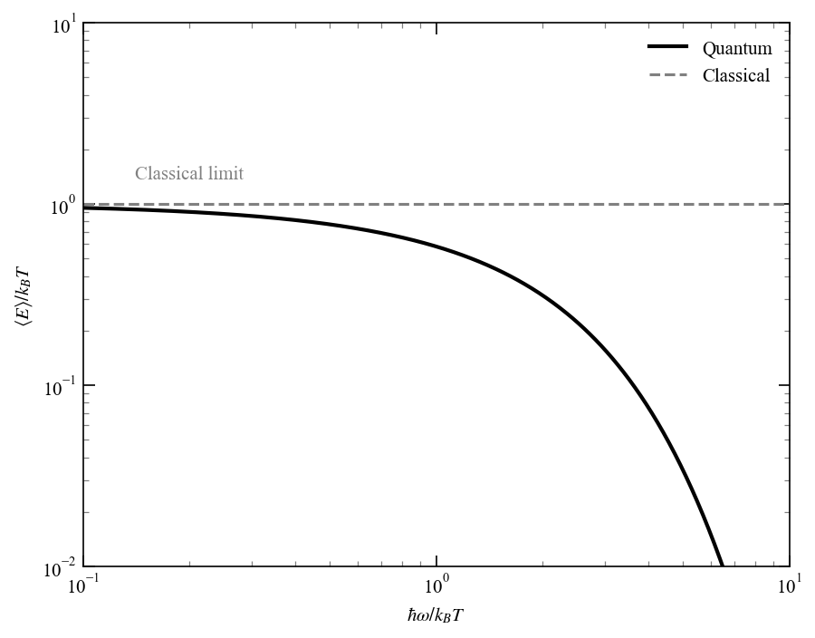

# Chapter 1: The Experimental Origins of Quantum Mechanics

<!-- ======================= -->

<!-- PROBLEM 1.1             -->

<!-- ======================= -->

## Problem 1.1

If $A > 0$, then

$$
\\sum\_{n=0}^{\\infty} e^{-An} = \\frac{1}{1 - e^{-A}}.
$$

Taking the derivative with respect to $A$ on both sides gives

$$
\\sum\_{n=0}^{\\infty} (-n) e^{-An} = -\\frac{e^{-A}}{(1 - e^{-A})^2}.
$$

or equivalently

$$
\\sum\_{n=0}^{\\infty} n e^{-An} = \\frac{e^{-A}}{(1 - e^{-A})^2}.
$$

<!-- ======================= -->

<!-- PROBLEM 1.2             -->

<!-- ======================= -->

## Problem 1.2

### Average energy

$$
\\begin{align}
\\langle E \\rangle &= \\frac{1}{Z}\\sum\_{n=0}^{\\infty} (n\\hbar \\omega) e^{-\\beta n \\hbar \\omega} \\
&= \\hbar \\omega \\frac{1}{Z} \\sum\_{n=0}^{\\infty} n e^{-\\beta n \\hbar \\omega} \\
&= \\hbar \\omega \\frac{1}{Z} \\frac{e^{-\\beta \\hbar \\omega}}{(1 - e^{-\\beta \\hbar \\omega})^2} \\
&= \\hbar \\omega \\left(1 - e^{-\\beta \\hbar \\omega}\\right) \\frac{e^{-\\beta \\hbar \\omega}}{(1 - e^{-\\beta \\hbar \\omega})^2} \\
&= \\hbar \\omega \\frac{e^{-\\beta \\hbar \\omega}}{1 - e^{-\\beta \\hbar \\omega}} \\
&= \\frac{\\hbar \\omega}{e^{\\beta \\hbar \\omega} - 1}
\\end{align}
$$

### Asymptotic limits

For $\\beta\\hbar \\omega \\ll 1$, we can use the Taylor expansion $e^{x} \\approx 1 + x$ for small $x$ to get

$$
\\langle E \\rangle \\approx \\frac{\\hbar \\omega}{1 + \\beta \\hbar \\omega - 1} = \\frac{\\hbar \\omega}{\\beta \\hbar \\omega} = \\frac{1}{\\beta} = k_B T.
$$

That is, in the high-temperature limit, the average energy approaches the classical result of $k_B T$.

For $\\beta \\hbar \\omega \\gg 1$, the exponential term dominates, so we have

$$
\\langle E \\rangle \\approx \\frac{\\hbar \\omega}{e^{\\beta \\hbar \\omega}} = \\hbar \\omega e^{-\\beta \\hbar \\omega}.
$$

```python
>>> from quantum_theory_hall.chapter01 import plot_average_energy
>>> plot_average_energy()
```



*Figure 1.2: Average energy of a quantum harmonic oscillator as a function of $\\hbar\\omega/k_B T$. The quantum result approaches the classical equipartition value $k_B T$ in the high-temperature limit.*

<!-- ======================= -->

<!-- PROBLEM 1.3             -->

<!-- ======================= -->

## Problem 1.3

Kinetic energy for quantum number $n$ is

$$
K_n = \\frac{1}{2}m_e v_n^2 = \\frac{1}{2}m_e r_n^2 \\omega_n^2 = \\frac{1}{2}\\frac{Q^2}{r_n},
$$

and the potential energy is

$$
V_n = -\\frac{Q^2}{r_n}.
$$

Total energy is then

$$
E_n = K_n + V_n = -\\frac{1}{2}\\frac{Q^2}{r_n} = -\\left(\\frac{m_eQ^4}{2\\hbar^2}\\right)\\frac{1}{n^2} = -\\frac{R}{n^2}
$$

<!-- ======================= -->

<!-- REFERENCES              -->

<!-- ======================= -->

## References

\\bibliography
