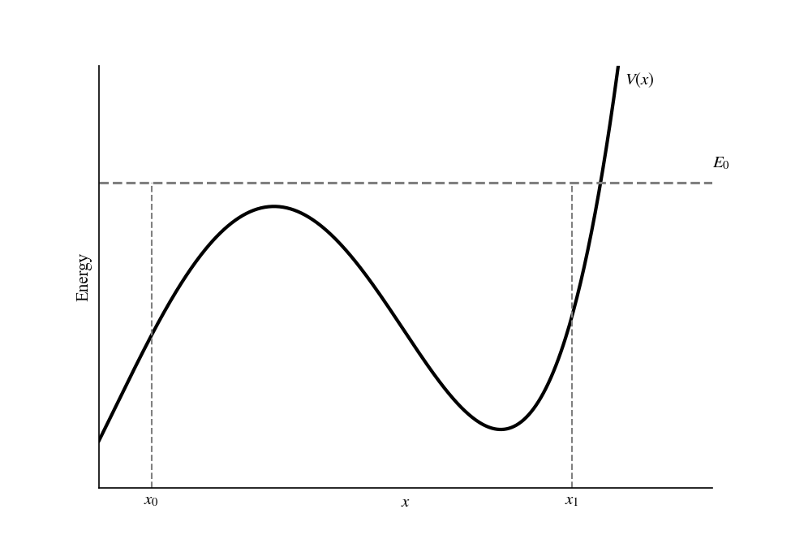
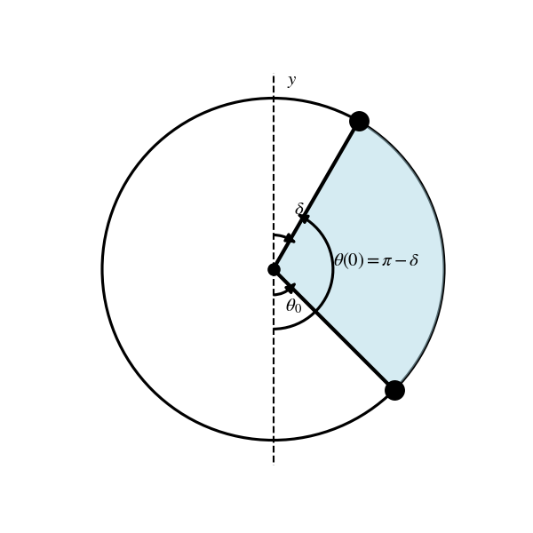
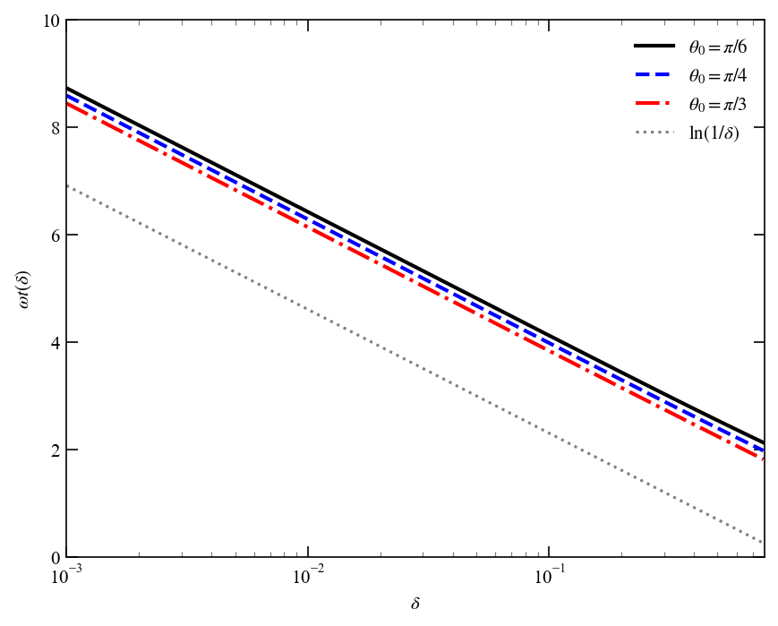

# Chapter 2: A First Approach to Classical Mechanics

<!-- ======================= -->

<!-- PROBLEM 2.1             -->

<!-- ======================= -->

## Problem 2.1

If the particle starts at $x_0 < x_1$ ($t=0$) then it will be moving to the right, and $dx/dt > 0$, which means

$$
\\frac{dx}{dt} = +\\sqrt{\\frac{2}{m}\\left(E_0 - V(x)\\right)}.
$$

Or equivalently, the time it would take to move from $x_0$ to $x_1$ is given by

$$
\\int_0^t dt = \\int\_{x_0}^{x_1} dx \\sqrt{\\frac{m}{2\\left(E_0 - V(x)\\right)}} = t.
$$

Assuming

*Figure 2.1: Sketch of the potential energy as a function of position. Points $x_0$ and $x_1$ are marked, indicating the region $x_0 \\leq x \\leq x_1$ such that $V(x) < E_0$.*

<!-- ======================= -->

<!-- PROBLEM 2.2             -->

<!-- ======================= -->

## Problem 2.2

### Part a

Assume that $V$ is at least $C^2$ near $x_1$, using a Taylor expansion about $x_1$ we have

$$
\\begin{align}
V(x) &= V(x_1) + V'(x_1)(x - x_1) + \\mathcal{O}((x - x_1)^2) \\
&\\simeq E_0 + V'(x_1)(x - x_1),
\\end{align}
$$

and since $x < x_1$ we can write

$$
E_0 - V(x) \\simeq V'(x_1)(x_1 - x),
$$

with $V'(x_1) > 0$ since the potential is increasing at $x_1$. Consider now $\\epsilon > 0$ such that the time to reach $x_1$ from $x_0$ can be split as

$$
\\begin{align}
t &= \\int\_{x_0}^{x_1}dx \\sqrt{\\frac{m}{2\\left(E_0 - V(x)\\right)}} \\
&= \\underbrace{\\int\_{x_0}^{x_1 - \\epsilon}dx \\sqrt{\\frac{m}{2\\left(E_0 - V(x)\\right)}}}_{\\tau, ~\\text{finite}} + \\int_{x_1 - \\epsilon}^{x_1}dx \\sqrt{\\frac{m}{2\\left(E_0 - V(x)\\right)}} \\
&\\approx \\tau + \\int\_{x_1 - \\epsilon}^{x_1}dx \\sqrt{\\frac{m}{2V'(x_1)(x_1 - x)}} \\
&= \\tau + \\sqrt{\\frac{m}{2V'(x_1)}} \\int\_{x_1 - \\epsilon}^{x_1}dx (x_1 - x)^{-1/2} \\
&= \\tau + 2\\sqrt{\\frac{m}{2V'(x_1)}} \\epsilon^{1/2},
\\end{align}
$$

which is finite as $\\epsilon \\to 0$. Therefore, the time to reach $x_1$ is finite.

### Part b

In this case

$$
\\begin{align}
V(x) &= E_0 + V'(x_1)(x - x_1) + \\frac{1}{2}V''(x_1)(x - x_1)^2 + \\mathcal{O}((x - x_1)^3) \\
& \\simeq E_0 + \\frac{1}{2}V''(x_1)(x - x_1)^2,
\\end{align}
$$

or

$$
E_0 - V(x) = -\\frac{1}{2}V''(x_1)(x - x_1)^2.
$$

The argument follows as before, splitting the time integral. So we we will only consider the integral close to $x_1$:

$$
\\int\_{x_1 - \\epsilon}^{x_1} dx ~ (x_1 - x)^{-1} \\to \\infty.
$$

Thus, the time to reach $x_1$ diverges.

<!-- ======================= -->

<!-- PROBLEM 2.3             -->

<!-- ======================= -->

## Problem 2.3

*Figure 2.3a: We want to find the time the pendulum takes to swing from the initial angle $\\theta(0) = \\pi - \\delta$ to the final angle $\\theta_0$ (shaded blue region).*

The potential energy for the mass on the pendulum is given by

$$
V(\\theta) = mgL(1 - \\cos\\theta),
$$

and the kinetic energy is

$$
K(\\theta) = \\frac{1}{2}mL^2 \\dot{\\theta}^2.
$$

The total energy is then

$$
E = \\frac{1}{2}mL^2 \\dot{\\theta}^2 + mgL(1 - \\cos\\theta).
$$

We can evaluate the total energy at $t=0$ ($\\dot{\\theta}(0) = 0$):

$$
E = mgL (1 - \\cos(\\pi - \\delta)) = mgL(1 + \\cos\\delta).
$$

Therefore

$$
mgL(1 + \\cos\\delta) = \\frac{1}{2}mL^2 \\dot{\\theta}^2 + mgL(1 - \\cos\\theta),
$$

or equivelently

$$
\\dot{\\theta}^2 = 2 \\omega^2 (\\cos\\theta + \\cos\\delta), \\quad \\omega^2 = g/L.
$$

The time it takes the pendulum to swing from $\\theta(0) = \\pi - \\delta$ to $\\theta_0$ is given by

$$
t(\\delta) = \\frac{1}{\\sqrt{2}\\omega}\\int\_{\\theta_0}^{\\pi - \\delta} d\\theta \\frac{1}{\\sqrt{\\cos \\theta + \\cos\\delta}}.
$$

Define $\\phi = \\pi - \\theta$, such that $\\phi(0) = \\delta$ and

$$
t(\\delta) = \\frac{1}{\\sqrt{2}\\omega}\\int\_{\\delta}^{\\phi_0} d\\phi \\frac{1}{\\sqrt{\\cos \\delta - \\cos\\phi}}.
$$

For small $\\delta$, or oquivalently for $\\phi$ close to zero, we can write

$$
\\cos\\delta - \\cos\\phi \\simeq \\frac{1}{2}(\\phi^2 - \\delta^2).
$$

Take $\\epsilon$ and split the integral as

$$
t(\\delta) = \\frac{1}{\\sqrt{2}\\omega}\\left(\\int\_\\delta^\\epsilon + \\int\_{\\epsilon}^{\\phi_0} \\right) \\frac{d\\phi}{\\sqrt{\\cos \\delta - \\cos\\phi}}.
$$

The second integral is bounded as $\\delta \\to 0$, the first intgral on the other hand can be approximated

$$
\\frac{1}{\\sqrt{2}\\omega} \\int\_\\delta^\\epsilon d\\phi \\frac{\\sqrt{2}}{\\sqrt{\\phi^2 - \\delta^2}} = \\frac{1}{\\omega} \\mathrm{arccosh}\\left(\\frac{\\epsilon}{\\delta}\\right) \\approx \\frac{1}{\\omega}\\ln \\left(\\frac{1}{\\delta}\\right)
$$

*Figure 2.3b: Time it takes for the pendulum to swing from the initial angle $\\theta(0) = \\pi - \\delta$ to the final angle $\\theta_0$ as a function of $\\delta$. The time diverges logarithmically as $\\delta \\to 0$. Added $\\omega t(\\delta)$ for reference.*

Figure 2.3b shows a plot of the time it takes for the pendulum to swing from the initial angle $\\theta(0) = \\pi - \\delta$ to the final angle $\\theta_0$ as a function of $\\delta$. As expected, the time diverges logarithmically as $\\delta \\to 0$.
